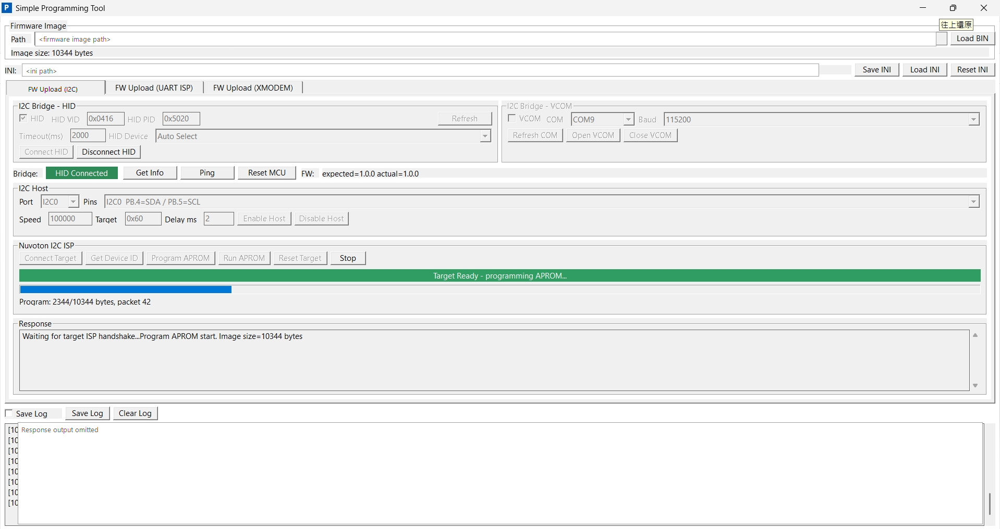
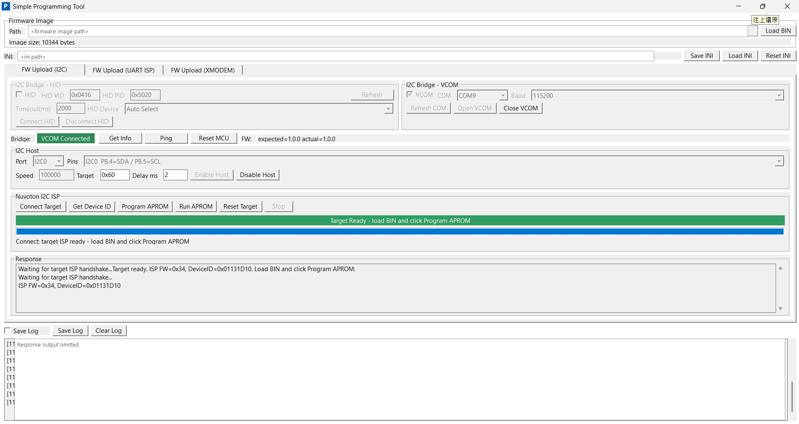
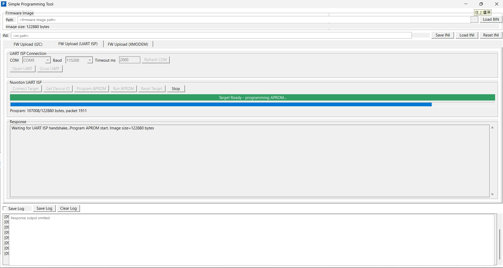
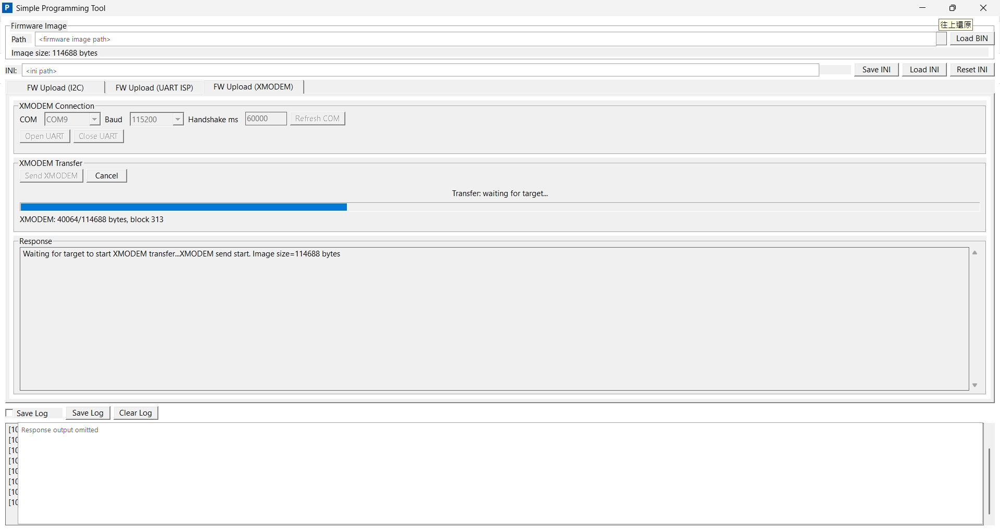

# SimpleProgrammingTool

Windows MFC GUI tool for programming a Nuvoton target MCU. The tool currently supports:

- `FW Upload (I2C)` through an M032 EVB programming bridge over USB HID or framed VCOM.
- `FW Upload (UART ISP)` through a direct UART ISP COM port.
- `FW Upload (XMODEM)` through a direct UART COM port and XMODEM SOH 128-byte blocks.

The firmware image is selected once at the top of the UI and reused by every upload tab.

## Scope

- Bridge board: M032 EVB
- I2C bridge PC transport: USB HID 64-byte reports or VCOM framed serial packets
- I2C bridge target transport: M032 EVB acts as I2C host
- Target firmware protocols: Nuvoton I2C ISP, Nuvoton UART ISP, and XMODEM receiver bootloaders
- Not in scope: PMBus/SMBus validation, generic script execution, target configuration readback

The I2C bridge firmware is expected to report:

- `m032-programming-bridge/1.0.0`

## Screenshots

The screenshots below are sanitized copies. Local firmware paths, INI paths, and response logs are intentionally redacted.









## Top-Level UI

### Firmware Image

- `Path`: selected binary image path. This is shared by all upload tabs.
- `Load BIN`: opens a file picker and loads the APROM/firmware binary.
- `Image size`: loaded image size in bytes. `No image loaded` means no binary is active.

### INI

- `INI`: current INI path used for tool settings.
- `Save INI`: writes the current UI settings to the INI file.
- `Load INI`: reloads settings from the INI file.
- `Reset INI`: restores default settings and rewrites the INI.
- `Build`: PC tool build version and build timestamp.

### Tabs

- `FW Upload (I2C)`: uses the M032 bridge and programs a target through I2C ISP.
- `FW Upload (UART ISP)`: opens a direct COM port and uses Nuvoton UART ISP packets.
- `FW Upload (XMODEM)`: opens a direct COM port and sends the image through XMODEM.

### Log Controls

- `Save Log`: checkbox enables runtime log capture.
- `Save Log` button: saves the current log content.
- `Clear Log`: clears the visible log.
- `Response`: per-tab operation response and diagnostic text.

## FW Upload (I2C)

This tab is for an M032 EVB acting as a programming bridge. HID and VCOM are mutually exclusive. Select one bridge group with its checkbox; the other group becomes disabled.

### I2C Bridge - HID

- `HID`: selects USB HID as the active PC-to-bridge interface.
- `HID VID` / `HID PID`: USB VID/PID filter. Default is VID `0x0416`, PID `0x5020`.
- `Timeout(ms)`: HID command timeout.
- `HID Device`: target HID device selector. `Auto Select` uses the first matching device.
- `Refresh`: rescans HID devices.
- `Connect HID`: opens the HID bridge.
- `Disconnect HID`: closes the HID bridge.

### I2C Bridge - VCOM

- `VCOM`: selects framed VCOM as the active PC-to-bridge interface.
- `COM`: COM port used by the bridge firmware.
- `Baud`: VCOM baud rate.
- `Refresh COM`: rescans available COM ports.
- `Open VCOM`: opens the COM port and validates the bridge response.
- `Close VCOM`: closes the COM port.

### Bridge Status

- `Bridge`: connection status. A green `HID Connected` or `VCOM Connected` label means the PC transport is open.
- `Get Info`: queries bridge firmware identity and version.
- `Ping`: sends a bridge ping command.
- `Reset MCU`: resets the M032 bridge MCU.
- `FW`: compares the expected bridge firmware version with the actual bridge response.

### I2C Host

- `Port`: M032 I2C controller used by the bridge firmware.
- `Pins`: selected SDA/SCL pin mapping for the chosen I2C port.
- `Speed`: I2C bus speed in Hz.
- `Target`: target I2C ISP address, commonly `0x60`.
- `Delay ms`: response delay between I2C ISP write/read phases.
- `Enable Host`: configures the M032 bridge as I2C host.
- `Disable Host`: releases the bridge I2C host.

### Nuvoton I2C ISP

- `Connect Target`: sends the Nuvoton ISP connect handshake until the target responds or timeout/cancel occurs.
- `Get Device ID`: connects to the target and reads ISP firmware version and PDID.
- `Program APROM`: writes the loaded top-level binary to the target APROM using the I2C ISP flow.
- `Run APROM`: asks the target to boot the programmed APROM.
- `Reset Target`: sends the target reset command.
- `Stop`: cancels before the next ISP packet or after the current bridge transaction returns.

The green status bar indicates target-ready or programming state. The progress bar and status text show byte and packet progress.

### I2C HID Workflow

1. Connect the M032 bridge board to the PC over USB.
2. Select `HID` in `I2C Bridge - HID`.
3. Click `Refresh`, choose a HID device, then click `Connect HID`.
4. Click `Get Info` and confirm the expected bridge firmware version.
5. Select I2C `Port`, `Pins`, `Speed`, target address, and delay.
6. Click `Enable Host`.
7. Put the target board into I2C ISP mode.
8. Click `Connect Target`; wait for the green target-ready message.
9. Click top-level `Load BIN` if no image is loaded.
10. Click `Program APROM`.
11. Click `Run APROM` when programming completes and the target should boot APROM.

### I2C VCOM Workflow

1. Connect the M032 bridge board to the PC and expose its bridge VCOM port.
2. Select `VCOM` in `I2C Bridge - VCOM`.
3. Click `Refresh COM`, choose the bridge COM port, set baud rate, then click `Open VCOM`.
4. Confirm the bridge status is green and `FW` shows the expected bridge version.
5. Select I2C `Port`, `Pins`, `Speed`, target address, and delay.
6. Click `Enable Host`.
7. Put the target board into I2C ISP mode.
8. Click `Connect Target`; wait for the green target-ready message.
9. Click top-level `Load BIN` if no image is loaded.
10. Click `Program APROM`.
11. Click `Run APROM` when programming completes and the target should boot APROM.

## FW Upload (UART ISP)

This tab uses a direct UART connection to a target running Nuvoton UART ISP firmware. It does not use the M032 HID/VCOM I2C bridge.

### UART ISP Connection

- `COM`: target UART ISP COM port.
- `Baud`: UART ISP baud rate.
- `Timeout ms`: serial command timeout.
- `Refresh COM`: rescans available COM ports.
- `Open UART`: opens the direct UART port.
- `Close UART`: closes the UART port.

### Nuvoton UART ISP

- `Connect Target`: sends the Nuvoton UART ISP connect handshake.
- `Get Device ID`: reads target ISP firmware version and PDID.
- `Program APROM`: sends the loaded top-level binary using Nuvoton UART ISP packets.
- `Run APROM`: asks the target to boot the programmed APROM.
- `Reset Target`: sends the target reset command.
- `Stop`: cancels before the next UART ISP packet.

The PC tool does not provide a start-address field for this tab. The target-side UART ISP firmware decides the erase/write address policy for its APROM update flow.

### UART ISP Workflow

1. Put the target into UART ISP mode.
2. Select the target COM port and baud rate.
3. Click `Open UART`.
4. Click `Connect Target` and confirm the green target-ready message.
5. Optionally click `Get Device ID`.
6. Click top-level `Load BIN` if no image is loaded.
7. Click `Program APROM`.
8. Click `Run APROM` when programming completes.

## FW Upload (XMODEM)

This tab sends the loaded binary through XMODEM to a target bootloader. It replaces the manual Tera Term send-file step while keeping the same packet behavior.

### XMODEM Connection

- `COM`: target bootloader COM port.
- `Baud`: UART baud rate.
- `Handshake ms`: maximum wait time for the target receiver to start XMODEM.
- `Refresh COM`: rescans available COM ports.
- `Open UART`: opens the direct UART port.
- `Close UART`: closes the UART port.

### XMODEM Transfer

- `Send XMODEM`: waits for target `C` or `NAK`, then sends SOH 128-byte XMODEM blocks.
- `Cancel`: sends XMODEM cancel when a transfer is active.
- Progress text: shows transferred bytes and block number.
- `Response`: transfer state and error text.

Repeated `C` characters from the target are normal for an XMODEM-CRC receiver while it waits for the sender. The target bootloader owns erase/write address policy; this tab only performs the file transfer.

### XMODEM Workflow

1. Put the target bootloader into XMODEM receive mode.
2. Select the target COM port and baud rate.
3. Set `Handshake ms` long enough for the target to emit `C` or `NAK`.
4. Click `Open UART`.
5. Click top-level `Load BIN` if no image is loaded.
6. Click `Send XMODEM`.
7. Wait for transfer complete, or click `Cancel` to abort.

## Build PC Tool

```bat
powershell -NoProfile -ExecutionPolicy Bypass -File scripts\build_mfc.ps1 -Configuration Release -Platform x64
```

Output:

- `build\SimpleProgrammingTool.exe`

The build script closes a running `SimpleProgrammingTool.exe` before compiling.

## Firmware Projects

- `demo_code\M031BSP_USB_HID_Programming_Bridge\SampleCode\Template\Keil\Template.uvprojx` - M032 EVB HID/VCOM to I2C programming bridge firmware.
- `demo_code\M031BSP_ISP_I2C\SampleCode\ISP_I2C` - M031 target I2C ISP LDROM sample for 4KB LDROM targets.
- `demo_code\M031BSP_ISP_I2C_2K\SampleCode\ISP_I2C` - M031 target I2C ISP LDROM sample for 2KB LDROM targets.

The 4KB LDROM CRC-validating target sample expects the APP image or post-build step to place the CRC32 word at `APROM_SIZE - 4`.

## Project Structure

- `src\` - MFC app, HID/VCOM/direct UART transports, FW Upload tabs, app state.
- `scripts\` - MFC build, version, and clean helper scripts.
- `demo_code\` - M032 bridge firmware and M031 ISP target samples.
- `docs\VCOM_TRANSPORT_ASSESSMENT.md` - VCOM transport assessment and firmware validation notes.
- `docs\images\` - sanitized README screenshots.

## GitHub Hygiene

Before publishing, confirm that only source, documentation, and sanitized images are staged.

The `.gitignore` intentionally excludes:

- `build/` PC binaries, objects, generated INI, and logs.
- Keil `obj/`, `lst/`, `.uvguix.*`, `.uvoptx`, `Nu_Link_Driver.ini`, and build logs.
- GCC/Eclipse local `preferences.ini`.
- Root `FW_Upload_*.jpg` screenshots because they may contain local machine paths. Use `docs/images/*.png` in documentation instead.

Suggested pre-upload checks:

```bat
git status --ignored
git add --dry-run .
rg -n --hidden --glob "!build/**" --glob "!demo_code/**/Keil/obj/**" --glob "!demo_code/**/Keil/lst/**" --glob "!demo_code/**/KEIL/obj/**" --glob "!demo_code/**/KEIL/lst/**" "[A-Z]:\\\\|Users\\\\" .
```

If prebuilt executables are needed, publish them as GitHub Release assets instead of committing the `build/` directory.
